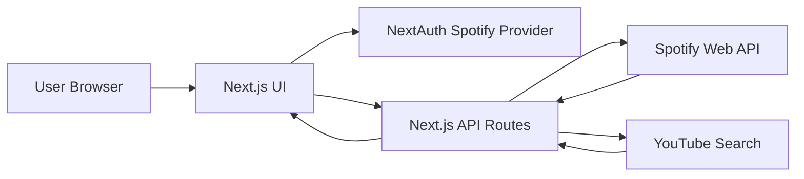

# MusicVideo
  
A Next.js app for exploring Spotify playlists and tracks, with quick access to related music videos on YouTube.

## Live Demo

https://mymusicvideo.netlify.app/

> The app requires Spotify authentication to display private or collaborative playlists.

## Features

- Spotify login using NextAuth.
- Lists the authenticated user's Spotify playlists.
- Displays tracks from a selected playlist.
- Opens tracks directly in Spotify.
- Searches related videos on YouTube.
- Responsive Spotify-inspired UI.

## Tech Stack

- Next.js 13
- React 18
- TypeScript
- NextAuth.js
- Spotify Web API
- scrape-youtube
- Tailwind CSS and custom CSS
- Netlify

## Architecture



The UI calls internal Next.js API routes instead of calling Spotify directly from the browser. The server-side API retrieves the user's refresh token from the NextAuth session and uses it to request playlists and tracks.

## Getting Started

### Prerequisites

- Node.js 18+
- npm
- Spotify Developer account

### Spotify Setup

Create an app in the [Spotify Developer Dashboard](https://developer.spotify.com/dashboard).

For local development, add this redirect URI:

```text

```

For production, configure your deployed callback URL:

```text
<https://mymusicvideo.netlify.app/api/auth/callback/spotify>
```

### Environment Variables

Create a `.env.local` file in the project root:

```env
SPOTIFY_CLIENT_ID=your_spotify_client_id
SPOTIFY_CLIENT_SECRET=your_s...cret
NEXTAUTH_SECRET=your_n...cret
NEXTAUTH_URL=<http://localhost:3000>
NEXT_PUBLIC_API_URL=/api
```

For production, configure the same variables in your hosting provider.

### Run Locally

```bash
git clone <https://github.com/JulioAmestica/musicvideo.git>
cd musicvideo
npm install
npm run dev
```

Open:

```text

```

## Main Routes

| Route | Description |
|---|---|
| `/` | Login and playlist browser |
| `/tracks?Listid=<playlist-id>&name=<playlist-name>` | Tracks for a selected playlist |
| `/api/playlists` | Returns Spotify playlists for the authenticated user |
| `/api/idlist/[idlist]` | Returns tracks for a playlist |
| `/api/youtube?q=<query>` | Searches a related YouTube video |

## Screenshots

Add screenshots here:

```md


```

## Known Limitations

- Requires Spotify authentication.
- YouTube matching is based on search results and may not always return the official video.
- No persistent database is used.
- Error handling and automated tests are limited.

## Status

Personal demo project. Core Spotify playlist browsing works; YouTube lookup is experimental and depends on third-party search results.

## License

No license has been specified yet.